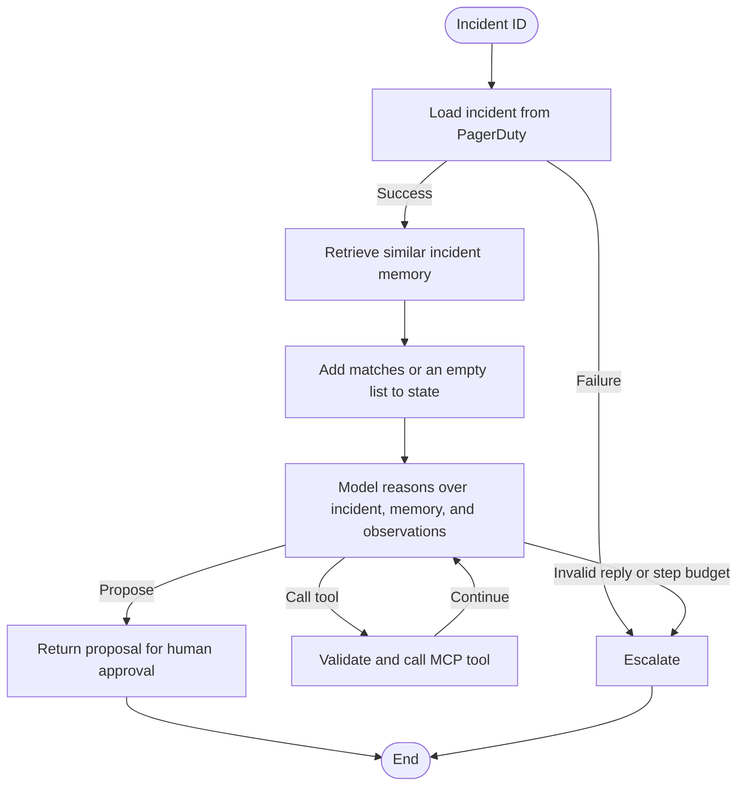

# SRE agent core loop

This is a small runnable sketch of the core loop. An incident comes in, the graph loads its canonical details and relevant local memory, then the model chooses MCP tools until it can propose a next step. It never executes the proposed action.

## Run it

```bash
uv sync
```

Open [demo.ipynb](demo.ipynb), select the **PD Home Task** kernel, and run the cells.

The default model is `mlx-community/Qwen3-8B-4bit`, a 4-bit quantization of Qwen3-8B, run locally on the Mac GPU with MLX. It needs an Apple Silicon Mac; the weights are about 4.6 GB and are downloaded from Hugging Face on the first run. Set `SRE_MODEL` to use another MLX model, for example the unquantized version on a Mac with 24 GB or more of memory:

```bash
export SRE_MODEL=mlx-community/Qwen3-8B-bf16
```

The notebook runs with Qwen3 thinking on, which gives better tool choices but is slower. Decoding uses Qwen's recommended sampling (temperature 0.6, top-p 0.95, top-k 20), so the tool path can differ between runs.

The notebook has three cases:

- `PINC2041`: a recent deploy explains an error spike.
- `PINC2052`: traffic and CPU explain high latency.
- `PINC2063`: local incident memory helps explain a repeated dependency failure.

The mocked MCP tools are `pagerduty.get_incident`, `gitlab.list_deployments`, and `grafana.query_prometheus`.

## How the loop works

1. Start with an `IncidentState` containing the incident and tenant IDs.
2. The graph first calls `pagerduty.get_incident`. This turns the opaque incident ID into a service, title, severity, and timestamp.
3. The memory node considers private incidents from the same tenant and service plus anonymized global patterns, ranks them with TF-IDF, and writes the top matches, or an empty list if none match, to `previous_similar_incidents`.
4. Add the MCP tool list, incident context, retrieved memory, and `Decision` schema to the prompt.
5. Ask the model for one decision: call one tool or finish with a proposal.
6. Parse the reply as JSON and validate it with Pydantic.
7. For a tool call, validate its arguments, call the mocked MCP server, append the result, and repeat.
8. The model may answer early when incident details and memory are enough, or gather current evidence to verify that the old resolution applies now.
9. For a proposal, stop and show it to the responder. Escalate if the initial incident lookup fails, the model returns two invalid replies, or the eight-step budget is exhausted.

After the initial incident lookup and memory retrieval, the model chooses the order of calls. The graph routes and enforces the boundaries around the loop.

## Graph




## Assumptions

- PagerDuty, GitLab, and Grafana are mocked, but their tools use MCP-style descriptions and input schemas.
- Resolved incident memory is local to the agent and is not presented as a third-party tool.
- All tool calls are read-only.
- The only write-like output is a proposal, and production-changing proposals are marked `needs_human_approval`.
- `tenant_id` is carried in state, but this is not production tenant isolation.
- The initial PagerDuty lookup is fixed; after that, the model chooses the tool order. A repeated incident lookup is refused, since the details are already in state.

## What is covered

### State

`IncidentState` holds observations, retrieved memory (`previous_similar_incidents`), the latest decision, proposal, step count, status, and escalation reason for one run. LangGraph passes it between nodes.

> **Next steps:** Persist each incident in PostgreSQL through a LangGraph checkpointer, keyed by tenant and incident (for example tools used, observations, proposal, approval, version and TimeStamps). Every step, such as a tool call, proposal, or approval, is appended to the incident's history, so a run can resume after a crash and be handed over.

### Memory

One anonymized global incident pattern lives in `src/sre_agent/data/incidents.md`. Before the model reasons, a graph node considers global patterns and private same-tenant, same-service incidents, ranks them with TF-IDF, and writes the best matches to `previous_similar_incidents`. Raw private incidents never cross tenants. Memory is treated as a prior, not proof.

> **Next steps:** Replace TF-IDF with embeddings, and add recency and outcome to the ranking. Write a reviewed summary back to memory after each successful resolution. Keep private memory tenant-isolated, with a separate opt-in, anonymized global pattern library.

### Actions and safety

Tools must be allowlisted, arguments are checked against their schemas, and the model can only return one of four **action** kinds. There is no executor, so the agent cannot change production and even if it could the proposal has a "needs_human_approval" flag.

Each run is bounded: an eight-step budget, at most two invalid model replies, and an escalation if the initial incident lookup fails. Errors from other tools come back as observations, so the model can recover instead of failing the run.

> **Next steps:** Despite the needs_human_approval flag, before any action could run, it would be worth adding safeguards such as tenant-scoped credentials or role-based access control that would only resume the workflow when confirmed.

### Extensibility

The loop is a LangGraph graph, so adding a step means adding a node and its edges, without touching the others. Memory retrieval was added this way, as one node between the incident lookup and the orchestrator. A policy check before `PROPOSE` or an approval step after it would fit the same way.

Tools follow the same idea through MCP. Each tool declares a name, description, and input schema. Registering it adds it to the model's tool list and puts it through the same allowlist and argument validation. The model decides when to call it, so a new tool needs no change to the graph or the prompt.

> **Next steps:** Replace the fixed server names with MCP discovery and a capability registry that holds authorization and credentials.

## What I left out

These sit outside the core loop the brief asks for (one responder, one surface, one agent), so I kept them out to focus on the loop and memory.

**Scale:** the agent handles one incident at a time with one local model, at about a minute per incident. In a regional outage, hundreds of alerts arrive together, most of them symptoms of the same cause. Each would run the full loop, repeat the same tool calls, and wait in line for the model.

> **Proposed solution:** Correlate alerts that share a region and time window into one parent incident, and run the agent once on the parent. Put the rest behind a durable priority queue ordered by severity, so the most urgent incidents are handled first and nothing is lost on restart. Cache tool results during a burst so shared queries run once, and enforce per-tenant and per-provider rate limits so one noisy tenant cannot exhaust the API quota for everyone.

**Multiplayer:** For several responders, or the same incident open in Slack and the web app, two people/agents could act on different versions of the state, or approve a proposal built on evidence that has since changed.

> **Proposed solution:** Make the durable incident record the single source of truth. Version every update, publish each change to all surfaces, and reject any approval made against an older version, so every responder acts on the same, current proposal.

**Languages:** the demo is English-only, in both the prompt and the proposal shown to the responder.

> **Proposed solution:** Frontier models already understand many languages, so the reasoning can stay as it is. Nevertheless, it would be worth exploring how translating incident data would affect the searchibility and result accuracy.

**Evaluation:** there is no test suite. The three notebook cases are checked by hand, and because decoding samples, a single run can pass or fail by chance, so one good run proves little.

> **Proposed solution:** Use Arize or Langsmith to store logs and have online evaluators for each trace measuring the answer's **Grounding**, **Output Correctness**, **Tool Efficiency**, etc... Also, offline evaluators could be added by having a fixed incident suite with an expected cause and action for each case, run several times per case and scored on pass rate. Old results could also be store within Arize Dataset section and compare it with the latest results to look for regressions or improvements over previous changes.

## Where it breaks first

- **Context size.** Every observation is sent back to the model on every turn. The mocks return small payloads, but a real Prometheus range query or deployment list can be thousands of lines, so a long incident fills the context window before it reaches the step budget, and the model starts losing earlier evidence. Probably keeping raw evidence in durable storage and send the model a bounded working summary, with each fact linked to its source observation.

- **Throughput in a regional outage.** One local model handles about one incident per minute. A burst of hundreds of alerts queues for hours, and the parallel tool calls hit third-party rate limits. Without correlation and queueing, many incidents repeat the same calls to reach the same answer.

- **Plausible but wrong diagnoses.** The code checks structure and boundaries (e.g schema-valid arguments), not whether the conclusion is true. In testing, the model sometimes blamed a deploy from days earlier or skipped the source that held the answer. This needs scenario evaluations for grounding checks. For example, before proposing a rollback, confirm in GitLab that the deploy landed shortly before the symptom and that its commit touches the failing code path, rather than being simply the most recent deploy. 

